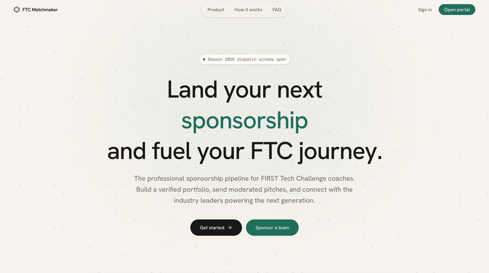
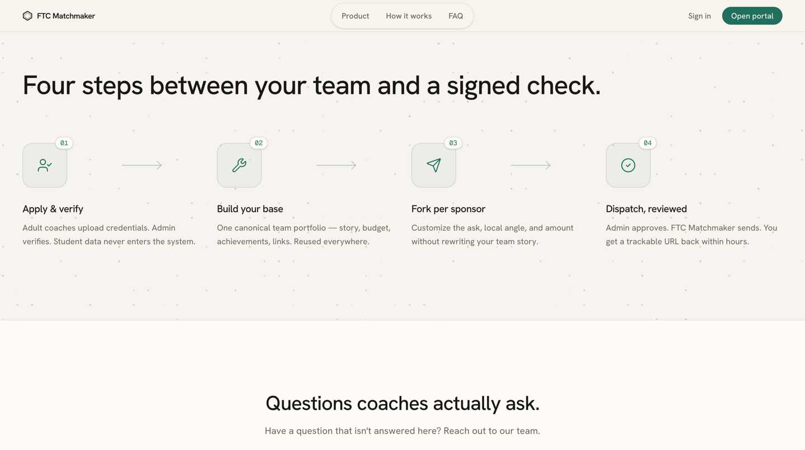

# FTC Matchmaker

### The moderated sponsorship pipeline for *FIRST* Tech Challenge teams.

Build one team portfolio. Send tailored pitches to real sponsors.
Every outbound email is read by a person before it leaves the platform.

**[→ Open the portal](https://ftc-sponsorship-portal.vercel.app)** &nbsp;·&nbsp;
[How it works](https://ftc-sponsorship-portal.vercel.app/#how) &nbsp;·&nbsp;
[FAQ](https://ftc-sponsorship-portal.vercel.app/#faq) &nbsp;·&nbsp;
[Sponsor a team](https://ftc-sponsorship-portal.vercel.app/sponsors/apply)

---

## What this is

Most FTC teams fund their season the same way: a coach writes the same email forty times, changes
the company name, and hopes. There's no record of who was contacted, no way to hand the process to
next year's coach, and nothing stopping two teams from pitching the same local business the same week.

FTC Matchmaker replaces that with a pipeline:

- **One canonical Portfolio.** Your team's story, budget, achievements and links live in one place.
  You write it once.
- **Pitches fork from it.** Each submission adds only what's specific to that sponsor — the ask,
  the local connection, what you need from *them*. Your team story is never rewritten.
- **Nothing sends itself.** Every pitch enters a review queue and is read by a person before a
  single email reaches a sponsor.
- **Students stay out of it.** Only verified adult coaches can hold an account. No student names,
  photos, or contact details are ever collected by the platform.

> **This is a moderated platform, not a signup funnel.** Any coach or company can apply, and every
> account is reviewed by a person before it's activated. That's deliberate — it's what lets us promise
> a sponsor that nothing in their inbox arrived unvetted, and it's why teams here aren't competing
> with a flood of automated outreach.

---

# For coaches

Everything below assumes you're the adult coach or mentor of record for an FTC team. That's who this
is built for.

### Before you start

Have these ready — it makes the whole process about twenty minutes instead of a week:

| You'll need | Why |
| --- | --- |
| **Your FTC team number** | Checked against the official *FIRST* team roster during signup |
| **Government photo ID** | Confirms you're an adult coach. Stored privately, visible only to admins, never public |
| **Your season budget** | Line items with real costs — "Robot build: $2,800", "Regional travel: $3,200" |
| **Your team's story** | 3–4 paragraphs: who you are, what you build, what you do for your community |
| **Photos or a video** | A team photo and a robot clip. Sponsors read these first |

> **Your Portfolio is private.** It is never published to the open web and has no public URL.
> The only people who ever see it are you, the admins who review your pitches, and the specific
> sponsors you choose to pitch. See [Student privacy](#student-privacy) below.

### 1. Create your account and get verified

Go to **[Get started](https://ftc-sponsorship-portal.vercel.app/signup)** and work through the signup
wizard. You'll confirm you're 18+, accept the terms, enter your team number, and upload your photo ID.

An admin reviews the ID by hand — this is the step that keeps the platform adults-only, and it's the
reason a sponsor can trust that a real coach is on the other end. You'll get an email as soon as
you're approved. **You can start building your Portfolio while you wait**; you just can't send a pitch
until verification clears.

### 2. Build your Portfolio

This is the part worth doing properly. Everything a sponsor sees comes from here.

- **Team story** — mission, what you've built, what your season looks like.
- **Technical summary** — the robot, your design process, the interesting engineering.
- **Outreach** — camps you run, teams you mentor, community work. Sponsors fund impact, not just robots.
- **Budget** — itemised, with a real total. Vague asks get ignored; "$2,800 for the drivetrain and
  $3,200 for regionals" gets answered.
- **Achievements** — awards, placements, milestones.
- **Media & links** — team photo, robot video, press coverage, your team site.

You write this **once**. Every pitch you ever send reuses it.

### 3. Find sponsors

Browse the sponsor directory from your dashboard. You'll see each company's industry, region, and
whether they still have funding capacity this season. Companies that have committed their full budget
drop off the list automatically, so you don't waste a pitch.

### 4. Write your pitch

Pick a sponsor and create a submission. You only fill in what's specific to them:

- **Why this sponsor** — the honest alignment. A machining company and a plastics distributor should
  not get the same paragraph.
- **Your local connection** — same town, an alum on staff, they hosted your team last year. This is
  the single highest-leverage field on the form.
- **What you're asking for** — an amount, or materials, or mentorship. Be specific.

### 5. Submit for review

Your pitch goes to the moderation queue. An admin will do one of three things:

- **Approve** — the pitch is sent to the sponsor with a private tracked link.
- **Request changes** — you'll get written feedback and can revise and resubmit. This is common on a
  first pitch and it is not a rejection.
- **Decline** — with a reason.

You're notified in-app and by email at every step.

### 6. After it's sent

The sponsor gets a clean, formatted version of your pitch at a private link — no login required for
them. From your dashboard you can see the status of every pitch you've sent. If a sponsor commits
funding, it's recorded against their capacity so the same money can't be promised twice.

### Coach FAQ

<strong>Does it cost anything?</strong>

 
No — FTC Matchmaker is free for FTC teams.

<strong>How long does review take?</strong>

 
Within 48 hours. You'll get an email either way — you never have to sit and refresh.

<strong>Can a student use this instead of me?</strong>

 
No. Accounts require a verified adult, and this is deliberate. Students can absolutely help write the
portfolio — but the account, the ID verification, and the sponsor correspondence stay with you.

<strong>Can I edit my Portfolio after sending pitches?</strong>

 
Yes, and updates flow into future pitches. Pitches already delivered keep the amount that was agreed
at approval time, so a sponsor is never surprised by a number changing after they said yes.

<strong>What happens to our data if we leave?</strong>

 
You can export your data or delete your account from Settings.

<strong>What if we're a brand new team with no achievements?</strong>

 
Say so plainly. Sponsors fund rookie teams all the time — a clear budget and a real community angle
beats a trophy list. Put the effort into the outreach and budget sections.

---

# For sponsors

**You'll hear from a team before you ever need an account.** Coaches pitch you through a moderated
queue, and every pitch is read by a person before it reaches your inbox — so you don't get forty cold
emails from forty teams.

If you'd like to support *FIRST* Tech Challenge teams:

**[Apply to sponsor →](https://ftc-sponsorship-portal.vercel.app/sponsors/apply)**

You set a funding cap for the season, and the platform enforces it — you cannot be over-committed,
even if several teams pitch you at once. You'll only ever see pitches that cleared review.

📧 **Questions, or want to talk to a person first? Email [support@exodiusftc.com](mailto:support@exodiusftc.com)** —
we'd rather have a conversation than send you a form.

---

## Student privacy

This matters more than any feature, so it's worth being precise.

**The platform does not collect student data.** There is no field anywhere for a student's name, age,
photo, email, or contact details, and no student can hold an account. Only verified adults register.
This is enforced in the database itself, not just in a policy document.

**Portfolios are private.** There is no public team page and no anonymous URL for your portfolio.
It's visible to you, to the admins reviewing your pitches, and to the sponsors you choose to pitch —
nobody else.

**What you should still know as a coach:** the free-text fields — team story, outreach summary,
subteam breakdown — and any photos you upload go out to sponsors in your pitch emails. Once an email
lands in someone's inbox you can't unsend it. So:

- ✅ *"Our outreach team ran a robotics camp for 40 elementary students."*
- ❌ *"Our programming lead Maria Chen rebuilt the autonomous routine."*

Write about your team in aggregate. Avoid naming students, and check team photos before uploading —
your school's media-release policy is the right standard to hold yourself to. Sponsors want to see
impact and engineering, and neither of those requires a single student's name.

---

## About

FTC Matchmaker was designed and built by **Anish Yarrakonda**, from an original idea by
**Rishi Jhaveri** (outreach lead) and **Shreyas Vempati** (team captain).

We compete as *FIRST* Tech Challenge **Team Exodius #31579**, and we built this because we needed it
ourselves. FTC Matchmaker is an independent project and is not affiliated with or endorsed by *FIRST*.

**This repository holds the public documentation only.** The application source is kept private —
not because we're against sharing (FTC runs on shared work), but because this is a live system
holding coaches' government ID documents and real sponsor relationships, and a public source tree for
a running production app is an unnecessary risk to the people using it. Happy to talk through the
architecture with any team that's curious — just email us.

- 🌐 **Portal:** [ftc-sponsorship-portal.vercel.app](https://ftc-sponsorship-portal.vercel.app)
- 📧 **Contact:** [support@exodiusftc.com](mailto:support@exodiusftc.com)
- 📄 [Terms](https://ftc-sponsorship-portal.vercel.app/legal/terms) ·
  [Privacy](https://ftc-sponsorship-portal.vercel.app/legal/privacy)

 
Built for Season 2026 · <em>FIRST</em> Tech Challenge Team Exodius #31579

